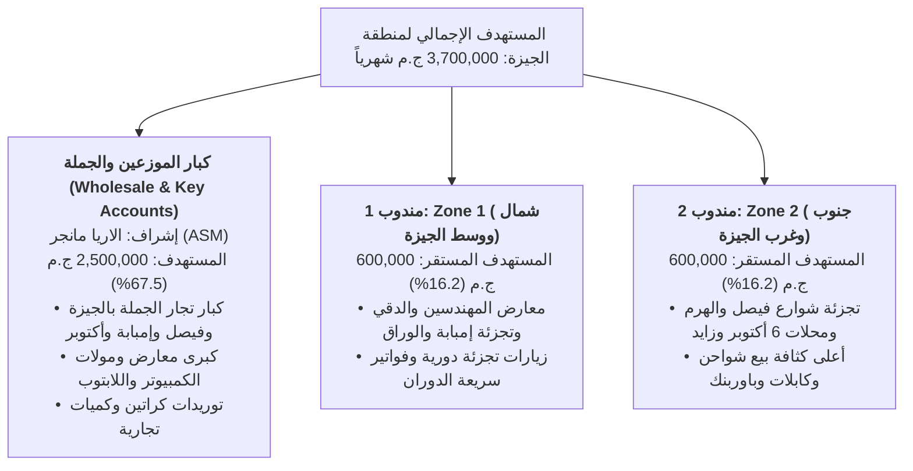
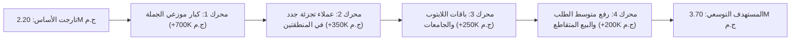
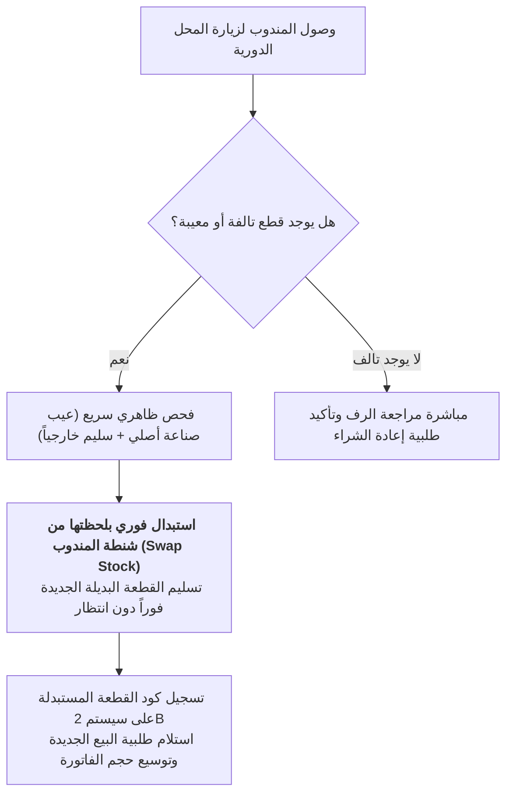
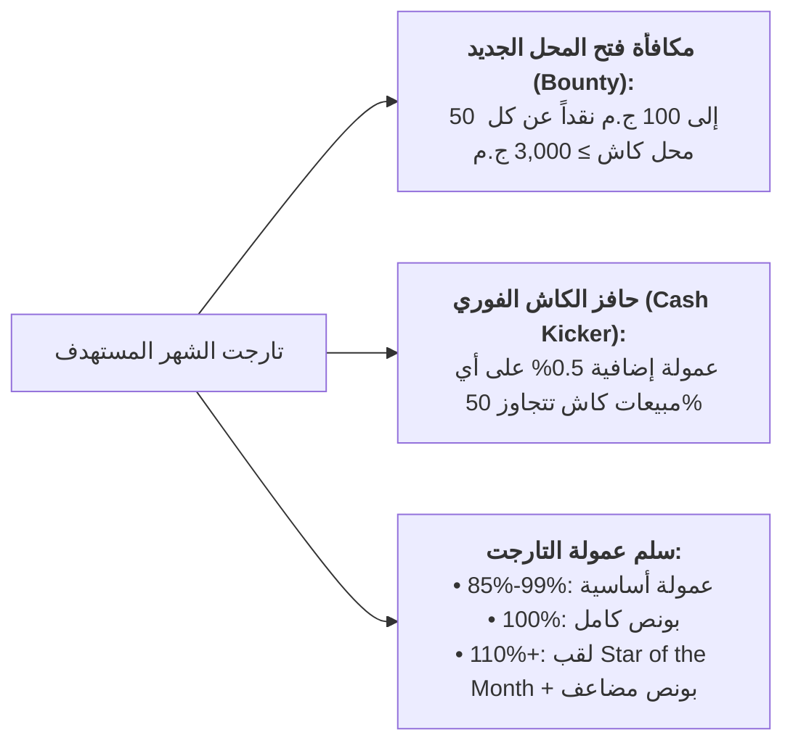
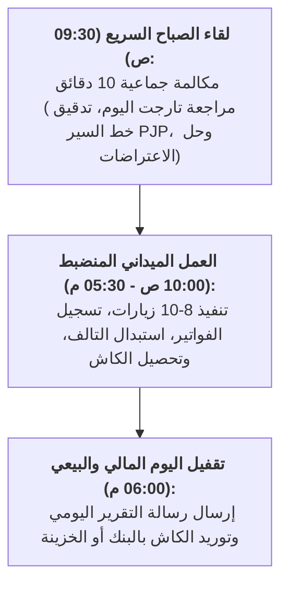

# الوثيقة الاستراتيجية التجارية الميدانية الشاملة: أريا الجيزة 2027 (Master Commercial Playbook)
**المؤسسة:** شركة توبي للتجارة والتوزيع (2B) — قطاع إكسسوارات الموبايل واللابتوب  
**النطاق الجغرافي:** قطاع الجيزة الكبرى ومحاور التوسع التجاري الكاملة  
**القيادة الإدارية:** مدير المنطقة البيعية (Area Sales Manager) + مندوبان ميدانيان (Zone 1 & Zone 2)  
**المرجع المالي الأساسي:** الأساس: **2,200,000 ج.م** | التوسع: **+1,500,000 ج.م** | المستهدف الإجمالي: **3,700,000 ج.م شهرياً** (**36,800,000 ج.م سنوياً لعام 2027**)  
**التصنيف:** وثيقة تشغيلية استراتيجية معتمدة ومحدثة (Advanced Operational Field Playbook)

---

## 1. الميثاق الاستراتيجي ومعايرة الواقع الميداني (Market Reality & Strategic Mandate)

تعتبر أريا الجيزة الكبرى الرقعة البيعية الأكثر حيوية وتنوعاً في مصر؛ نظراً لاحتوائها على أكبر شريان بيع تجزئة للموبايل (شارع فيصل والهرم وإمبابة)، وأضخم تجمع لمعارض اللابتوب والكمبيوتر (الدقي والمهندسين)، وأكبر كتلة جامعية في الجمهورية (جامعة القاهرة، جامعة 6 أكتوبر، MUST، وجامعة النيل).

### المبادئ القيادية المعتمدة:
1. **التركيز المطلق على قطاع الجيزة الكبرى:** توجيه 100% من الطاقة التشغيلية والإشراف الميداني لاكتساح أرفف محلات الجيزة ومعارضها.
2. **المعايرة الواقعية لحماية الفريق:** توزيع التارجت يراعي قدرة منافذ التجزئة، بحيث يبدأ المندوب الجديد بـ **350,000 ج.م** في الشهر الأول ويتدرج تدريجياً حتى **600,000 ج.م**، بينما يستوعب قطاع الجملة والصفقات المؤسسية الكتلة الحجمية الأكبر (**2.5 مليون ج.م**) بقيادة مدير المنطقة.
3. **أولاً الكاش وأبداً لا للديون:** الحفاظ الصارم على نسبة كاش لا تقل عن **50%** في كافة العمليات البيعية، وتطبيق قاعدة الإيقاف التلقائي للتوريدات في حال تأخر السداد.

---

## 2. الهيكلة المالية الواقعية وتوزيع الحصص البيعية (Realistic Quotas)



### جدول توزيع الحصص الشهرية المعقولة ومؤشرات السيولة:

| القناة / المسؤول التجاري | طبيعة العمل والعملاء المستهدفين | التارجت الشهري المعقول | حصة الكاش الفوري (50%) | سقف الآجل المنضبط (50%) | نسبة المساهمة |
| :--- | :--- | :--- | :--- | :--- | :--- |
| **كبار الموزعين والجملة (بإشراف ASM)** | كبار تجار الجملة + معارض الكمبيوتر الكبرى والصفقات | **2,500,000 ج.م** | 1,250,000 ج.م | 1,250,000 ج.م | 67.5% |
| **مندوب 1 (Zone 1 - شمال الجيزة)** | تجزئة المهندسين، الدقي، العجوزة، إمبابة، الوراق | **600,000 ج.م** | 300,000 ج.م | 300,000 ج.م | 16.2% |
| **مندوب 2 (Zone 2 - جنوب الجيزة)** | تجزئة فيصل، الهرم، العمرانية، 6 أكتوبر، الشيخ زايد | **600,000 ج.م** | 300,000 ج.م | 300,000 ج.م | 16.2% |
| **الإجمالي المعتمد لمنطقة الجيزة** | **كامل قطاعات التجزئة والجملة** | **3,700,000 ج.م** | **1,850,000 ج.م** | **1,850,000 ج.م** | **100%** |

---

## 3. جسر الإيرادات المعقول: تفكيك الـ 1.5M ج.م الإضافية



1. **توسيع حصة كبار موزعي الجملة بالجيزة وأكتوبر (+700,000 ج.م شهرياً):**  
   إبرام اتفاقيات توريد منتظمة مع 4-5 موزعين كبار بمتوسط سحب 140,000 - 150,000 ج.م شهرياً بخصومات سداد معجلة.
2. **فتح منافذ تجزئة جديدة بالمنطقتين (+350,000 ج.م شهرياً):**  
   فتح 16 إلى 20 منفذ تجزئة جديد شهرياً (8-10 محلات لكل مندوب) بفواتير افتتاحية نقدية بمتوسط 3,000 إلى 5,000 ج.م.
3. **صفقات معارض ومكتبات محيط الجامعات واللابتوب (+250,000 ج.م شهرياً):**  
   حزم مجمعة (حقيبة لابتوب + ماوس + محول Type-C Hub) لمعارض الدقي والمهندسين ومحيط جامعة القاهرة وجامعات 6 أكتوبر.
4. **تنشيط البيع المتقاطع ورفع سلة إعادة الطلب (+200,000 ج.م شهرياً):**  
   ربط شواحن GaN السريعة بالكابلات المعتمدة، لرفع متوسط فاتورة إعادة الطلب من 4,000 إلى 5,500 ج.م.

---

## 4. خطة الـ 90 يوماً الانتقالية المتدرجة والمعقولة (30-60-90 Ramp-Up)

| المعيار التشغيلي | الشهر الأول (Month 1: التأسيس) | الشهر الثاني (Month 2: التوسع) | الشهر الثالث (Month 3: الاستقرار) |
| :--- | :--- | :--- | :--- |
| **المستهدف المالي الإجمالي للأريا** | **2,700,000 ج.م** (+500K نمو) | **3,200,000 ج.م** (+500K نمو إضافي) | **3,700,000 ج.م** (اكتمال التارجت كاملاً) |
| **حصة كبار الموزعين والجملة (ASM)** | 2,000,000 ج.م | 2,300,000 ج.م | **2,500,000 ج.م** |
| **حصة مندوب 1 (Zone 1)** | **350,000 ج.م** | **450,000 ج.م** | **600,000 ج.م** |
| **حصة مندوب 2 (Zone 2)** | **350,000 ج.م** | **450,000 ج.م** | **600,000 ج.م** |
| **معدل الزيارات اليومي الفعلي** | 8 - 10 زيارات مخططة / مندوب | 8 - 10 زيارات مخططة / مندوب | 8 - 10 زيارات مخططة / مندوب |
| **معدل الفواتير الناجحة (Strike Rate)** | 4 - 5 فواتير يومياً | 5 - 6 فواتير يومياً | 6 - 7 فواتير يومياً |
| **العملاء الجدد المستهدفون** | 8 عملاء تجزئة كاش / مندوب | 10 عملاء تجزئة / مندوب | 10-12 عميلاً جديداً / مندوب |
| **متوسط قيمة الفاتورة المعتمدة** | 3,000 - 4,500 ج.م | 4,000 - 5,500 ج.م | 5,000 - 6,500 ج.م |
| **شروط الدفع المعتمدة للتجزئة** | كاش فوري 100% لأول فاتورتين | كاش فوري + آجل منضبط 7-10 أيام | 50% كاش فوري : 50% آجل بحد أقصى 15K |

---

## 5. المستهدف السنوي الواقعي لعام 2027 (36,800,000 ج.م)

* **المستهدف السنوي المتوقع:** **36,800,000 ج.م** (نمو مدروس بنسبة **+28%** يراعي فترات الهدوء والذروة).
  * **Q1 (يناير - مارس):** **7,500,000 ج.م** (تجديد مخزون التجار بعد الجرد وإجازة نصف العام).
  * **Q2 (أبريل - يونيو):** **9,000,000 ج.م** (الأعياد وبداية الصيف وحركة السفر وبنوك الطاقة).
  * **Q3 (يوليو - سبتمبر):** **11,000,000 ج.م** (الموسم الذهبي: ذروة الجامعات والعودة للمدارس واللابتوب).
  * **Q4 (أكتوبر - ديسمبر):** **9,300,000 ج.م** (عروض البلاك فرايداي وإغلاق الاتفاقيات السنوية والتصفيات).

---

## 6. حصر الشوارع والمناطق التجارية بالجيزة (Territory Census)

### أ. قطاع Zone 1 (المندوب الأول — شمال ووسط الجيزة):
* **المهندسين:** شارع جامعة الدول العربية، سوريا، لبنان، أحمد عرابي، والبطل أحمد عبد العزيز.
* **الدقي:** شارع التحرير، مصدق، محيط محطة المترو، ومول التحرير للكمبيوتر.
* **إمبابة وبشتيل والوراق:** شارع الوحدة، طلعت حرب، القومية العربية، وترعة السواحل (تجزئة الموبايل والصيانة).

### ب. قطاع Zone 2 (المندوب الثاني — جنوب وغرب الجيزة وأكتوبر):
* **شارع فيصل الرئيسي:** محطات العشرين، حسن محمد، المطبعة، العريش، والتعاون (أعلى كثافة تجزئة موبايل).
* **شارع الهرم الرئيسي:** محطات نصر الدين، مدكور، كايرو مول، والعريش.
* **مدينة 6 أكتوبر والشيخ زايد:** ميدان الحصري، المحور المركزي، مجمع الماجدة، وسيتي ستارز ومحيط مول العرب.

---

## 7. جدول خط السير الأسبوعي المنضبط PJP (Beat Plan)

### خط سير مندوب 1 (Zone 1 - شمال الجيزة):
* **السبت:** معارض الدقي ومول التحرير للكمبيوتر ومحيط المترو.
* **الأحد:** المهندسين (شارع جامعة الدول وميدان مصطفى محمود).
* **الاثنين:** المهندسين والعجوزة (سوريا، لبنان، ونوال).
* **الثلاثاء:** إمبابة (شارع الوحدة وميدان الكيت كات).
* **الأربعاء:** الوراق وبشتيل (القومية العربية وترعة السواحل).
* **الخميس:** جولة التحصيل الأسبوعي ومتابعة معارض الدقي وإعادة الطلب.

### خط سير مندوب 2 (Zone 2 - جنوب الجيزة):
* **السبت:** أول شارع فيصل حتى محطة العشرين ومحيطها.
* **الأحد:** فيصل الأوسط من حسن محمد حتى العريش والتعاون.
* **الاثنين:** شارع الهرم الرئيسي (كايرو مول، العريش، ونصر الدين).
* **الثلاثاء:** 6 أكتوبر (ميدان الحصري والمحور المركزي ومجمع الماجدة).
* **الأربعاء:** الشيخ زايد ومحيط المولات والمحلات التجارية الكبرى.
* **الخميس:** جولة التحصيل الأسبوعي ومتابعة عملاء فيصل والهرم وإعادة الطلب.

---

## 8. حوكمة التحصيل وإدارة الائتمان المنضبط (Credit & Cashflow Control)

1. **قاعدة الكاش أولاً للعميل الجديد:** أي محل تجزئة جديد يتعامل كاش فوري 100% لأول فاتورتين لإثبات الجدية قبل تفعيل أي حد ائتماني.
2. **سقف الائتمان المنضبط:** سقف محدد بين **10,000 إلى 15,000 ج.م** بمهلة سداد **10 إلى 14 يوماً** بنظام (فاتورة تسد فاتورة).
3. **قاعدة الوقف الصارم Stop-Supply:** تجميد فوري لأي عميل يتأخر أكثر من 7 أيام عن موعد السداد، ومنع صرف أي طلبيات جديدة آلياً.

---

## 9. بروتوكول الاستبدال السريع للتالف في نفس اللحظة (RMA Fast-Track)



### القواعد التشغيلية لشنطة الاستبدال:
* يُسلّم كل مندوب عهدة بضاعة استبدال عائمة (Swap Stock) بقيمة **2,500 ج.م** (شواحن سريعة وكابلات الأكثر دوراناً).
* الاستبدال يتم **في ثوانٍ معدودة** أمام التاجر، مما يزيل أكبر حاجز نفسي لديه ويجعله يفضل منتجات 2B على كافة المنافسين.
* توريد القطع التالفة أسبوعياً لمخزن الشركة يوم الخميس واستعاضة شنطة الاستبدال فورياً.

---

## 10. برنامج ولاء تاجر التجزئة (2B Retail Loyalty Club)

برنامج ربع سنوي يربط التاجر بعلامة 2B ويحفزه على التوصية بها للزبائن:

| شريحة التاجر | شرط السحب والالتزام الشهري | المزايا التسويقية والبونص الممنوح |
| :--- | :--- | :--- |
| **الشريحة الفضية (Silver Partner)** | سحب شهري &ge; **10,000 ج.م كاش** مع انتظام السداد | بضاعة بونص مجانية بقيمة **300 ج.م** شهرياً + استاند كاونتر مدمج مجاني |
| **الشريحة الذهبية (Gold Partner)** | سحب شهري &ge; **20,000 ج.م كاش** مع انتظام السداد | بضاعة بونص مجانية بقيمة **800 ج.م** + هدايا عينية (تيشيرتات وكابات 2B للبائعين + ماجات) |
| **الشريحة البلاتينية (Platinum Partner)** | سحب شهري &ge; **35,000 ج.م** (كبار محلات فيصل والهرم) | بضاعة بونص بقيمة **1,500 ج.م** + تركيب واجهة أو لوحة مضيئة (Light Box) باسم 2B بالمحل |

---

## 11. هيكل العمولات والحوافز التنافسي للمندوبين الجدد (Gamified Incentive Scheme)

نظام مكافآت فورية يحفز المندوبين الجدد على فتح السوق وحماية الكاش:



* **مكافأة فتح الحساب الجديد (New Account Bounty):** مكافأة **50 ج.م** (تصل إلى 100 ج.م للمحلات الكبيرة) عن كل محل جديد يُسجل ويشتري فاتورة كاش أولى &ge; 3,000 ج.م.
* **حافز تفوق الكاش (Cash Kicker):** عمولة نقدية فورية **0.5%** عن أي مبالغ نقدية تُحصل فوق نسبة الـ 50% المقررة شهرياً.

---

## 12. استراتيجية "كاونتر الدفع الذهبي" واستبدال المنافسين (POSM & Competitor Hunt)

### أ. كاونتر الدفع الذهبي (Golden Checkout Counter):
* أكثر من **60%** من مبيعات الكابلات والشواحن في مصر تتم بدافع الشراء اللحظي (Impulse Buying) أثناء دفع الحساب عند الكاشير.
* تزويد المحلات بوحدات عرض كاونتر مدمجة ومضيئة (Acrylic Counter Displays) تسع 6 كابلات و3 شواحن سريعة توضع **مباشرة بجانب درج النقدية/الكاشير**.
* شرط منح الاستاند: توقيع التاجر على إقرار حصرية عرض منتجات 2B على الاستاند لمدة 6 أشهر.

### ب. خطة صيد عملاء المنافسين (Competitor Replacement Offer):
* استهداف المحلات التي تعرض علامات منافسة (Joyroom, Oraimo, LDNIO) وتقديم عرض استبدال جذاب:
  * منح التاجر خصم كاش إضافي **3%** على أول طلبية استبدال لعلامة منافسة.
  * استبدال فوري لأي قطعة تالفة لديه بنظام الضمان المباشر المعتمد.

---

## 13. طقوس الإدارة والتشغيل اليومي (Daily Sales Operating Rhythm)

منظومة انضباط تمنع تشتت المندوبين وتضمن الرقابة اليومية اللحظية:



### نموذج رسالة التقفيل اليومي القياسية (Daily Call Sheet Template عبر واتساب):
```text
تقرير اليوم: [التاريخ] | المندوب: [الاسم - Zone ...]
1. إجمالي الزيارات المخططة: [ ] | الزيارات الفعلية المنفذة: [ ]
2. عدد الفواتير الناجحة (Strike): [ ] (بمعدل نجاح: ..%)
3. إجمالي مبيعات اليوم: [ ] ج.م
4. المتحصلات النقدية (كاش فوري): [ ] ج.م (نسبة الكاش: ..%)
5. المتحصلات الآجلة المعتمدة: [ ] ج.م
6. المحلات الجديدة التي تم فتحها اليوم: [اسم المحل / المنطقة / قيمة الفاتورة كاش]
7. التالف المستبدل (RMA): [عدد القطع / القيمة]
8. تم توريد النقدية: [رقم إيصال الإيداع أو الخزينة]
```

---

## 14. كتيب صفقات الجامعات ومعارض اللابتوب بالجيزة (Campus B2B Playbook)

تستثمر هذه الخطة وجود أكبر كتلة طلابية وتقنية في مصر بقلب الجيزة:
* **حزم الطلاب الذكية (Smart Campus Bundles):**
  * حزمة تضم: (حقيبة ظهر 2B مقاومة للمطر + ماوس وايرلس مريح + موزع منافذ Type-C Hub).
* **منافذ الاستهداف المؤسسي بالجيزة:**
  * مكتبات ومعارض الكمبيوتر بمحيط جامعة القاهرة (بين السرايات، الدقي، والشارع التجاري).
  * مكتبات ومولات محيط جامعة 6 أكتوبر وميدان الحصري وجامعة مصر للعلوم والتكنولوجيا (MUST).
  * معارض مول التحرير بالدقي ومول سوق العصر وشارع سوريا بالمهندسين.
* **التعاقدات الرسمية للأنشطة والاتحادات الطلابية:** تقديم عروض توريد رسمية لاتحادات الكليات ورعاية الشباب كهدايا وشنط للمؤتمرات والمسابقات التقنية.

---

## 15. دليل التعامل مع اعتراضات السوق الميداني (Field Objection Handling)

1. **اعتراض التاجر: "سعرك أغلى من البضاعة المضروبة أو المستوردة بدون ضمان":**  
   * **الرد الميداني المعتمد:** "البضاعة المجهولة بتكسبك مرة واحدة، وأول ما تبوظ بتخسر زبونك وسمعة محلك. منتج 2B عليه ضمان معتمد واستبدال فوري بلحظتها، العميل بيثق فيه وبيرجعلك مخصوص، والشركة بتعوضك بأي قطعة فيها عيب صناعة فوراً في نفس الزيارة."
2. **اعتراض التاجر: "المحل زحمة ومفيش مكان لستاند كبير":**  
   * **الرد الميداني المعتمد:** "وفرنا لحضرتك وحدة كاونتر مدمجة فاخرة حجمها صغير جداً بتتحط جنب شاشة الكاشير، مش هتاخد مساحة وهتبيع للزبون وهو بيحاسب كابل أو شاحن سريع فوراً بنظام الشراء اللحظي."
3. **اعتراض التاجر: "أنا كل شغلي على النوتة وآجل، مش هدفع كاش":**  
   * **الرد الميداني المعتمد:** "يشرفنا التعامل مع حضرتك، وسياسة الشركة بتفتح حساب آجل بمهلة سداد مريحة فور انتظام أول فاتورتين كاش وتفعيل الحساب؛ ده بيضمن لحضرتك خصم الكاش الفوري ويثبت جديتك في النظام."
4. **اعتراض التاجر: "الشركات التانية بتأخر التالف وبتدوخنا":**  
   * **الرد الميداني المعتمد:** "معانا التالف بيستبدل في ثوانٍ؛ المندوب معاه شنطة استبدال عائمة، بيفحص القطعة السليمة ظاهرياً ويديك بديلها جديد فوراً في نفس اللحظة بدون أي انتظار."
